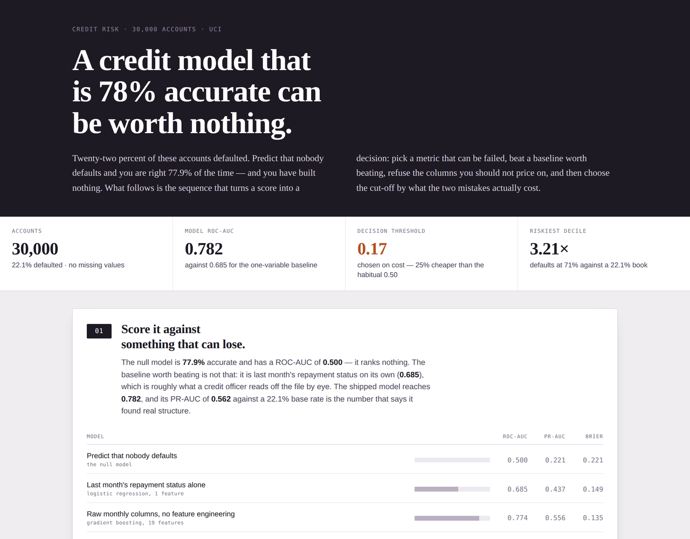

# The Default Cut-Off

**[▶ Open the interactive dashboard](https://asadali-github.github.io/credit-default-risk/)**

A credit-default scorecard on 30,000 real accounts — and, more to the point, the argument
that has to go with one: why accuracy is the wrong metric, what dropping the protected
attributes actually costs, and where the decision threshold should sit once you price the
two mistakes differently.

[](https://asadali-github.github.io/credit-default-risk/)

## Start with the number that should stop you

22.1% of these accounts defaulted. So a model that predicts *nobody defaults* is **77.9%
accurate** — and is worth exactly nothing. Accuracy is not reported anywhere in this project
except as that warning. Everything is scored on ROC-AUC (ranking), PR-AUC (ranking, with the
class imbalance taken seriously) and Brier (whether the number can be believed).

| Model | ROC-AUC | PR-AUC | Brier |
|---|---:|---:|---:|
| Predict that nobody defaults | 0.500 | 0.221 | 0.221 |
| Last month's repayment status alone *(logistic, 1 feature)* | 0.685 | 0.437 | 0.149 |
| Raw monthly columns, no feature engineering | 0.774 | 0.556 | 0.135 |
| Everything in the file, protected attributes included | 0.780 | 0.559 | 0.134 |
| **Behaviour only — the shipped model** | **0.782** | **0.562** | **0.134** |

The baseline that matters is the second row, not the first. Beating "the average account"
proves nothing; beating *last month's repayment status*, which is roughly what a credit
officer reads off the file by eye, is the bar worth clearing.

## What the model is actually reading

Recent conduct, and very little else. An account revolving a balance defaults 12.8% of the
time; two months behind, that jumps to **69.1%**. Shuffle the worst-arrears column and the
model loses **0.069** ROC-AUC — three times more than any other feature. Utilisation, credit
limit and payment size all contribute, but at an order of magnitude less.

## The protected attributes come out

Sex, education, marital status and age are all sitting in the file. Trained with them the
model scores **0.7804**; trained without them, **0.7819**. Including them does not even help,
so there is no trade-off to argue about — they go.

That is step one. Step two is checking what the decision does anyway, because removing a
column removes the column, not the correlation:

| Group | Declined at 0.17 | Actually defaulted | ROC-AUC |
|---|---:|---:|---:|
| Male | 43.1% | 24.4% | 0.773 |
| Female | 40.8% | 20.6% | 0.788 |
| Graduate school | 38.0% | 18.8% | 0.776 |
| University | 42.7% | 23.2% | 0.775 |
| High school | 48.7% | 27.5% | 0.804 |

The model still declines a larger share of men than women, and of high-school-educated
applicants than graduates, because repayment behaviour is not independent of who holds the
account. That is a finding to put in front of a compliance team, not a number to bury.

## The cut-off is a decision, not a default

0.5 is a convention inherited from `predict()`. Charging **5** for a default that slips
through and **1** for a good customer wrongly declined, the cheapest threshold is **0.17**:

| | 0.50 (habitual) | 0.17 (cost-optimal) |
|---|---:|---:|
| Cost per 1,000 applications | 743.7 | **554.4** |
| Defaulters caught | 36% | **73%** |
| Precision | 69% | 39% |
| Share of applicants declined | 12% | 42% |

A **25% saving**, bought by accepting far more false positives — which is the correct trade
when a missed default costs five times a lost customer. The dashboard lets you drag the
threshold and watch the four outcomes move; that interaction *is* the argument.

## Can the score be read as a probability?

It has to be. A risk score gets quoted in policy and summed into expected-loss figures, so
ranking alone is not enough. Across ten equal-sized groups the largest gap between predicted
and observed risk is **2.4 percentage points**, and the Brier score is 0.134 against 0.221
for the null model. When this model says 43%, roughly 43% of those accounts default.

## Ranking

Sorted by score, the riskiest tenth of accounts defaults at **71%** — 3.2× the book — and the
safest tenth at 4.3%. Three deciles hold **63%** of every default in the test set: a
collections team can work 30% of the book and reach two-thirds of the losses.

## Run it yourself

```bash
pip install -r requirements.txt

python analysis.py           # every figure above, printed; writes results.json
python build_dashboard.py    # rebuilds index.html from that results.json
python -m pytest tests/ -v   # 14 tests
```

The cost ratio lives in two constants at the top of `analysis.py`. Change them and the
optimal threshold, the cost curve and the dashboard's headline all move together — which is
the point of computing it rather than asserting it.

## Tests

The 14 tests defend the claims rather than the imports. They check that the dataset still
matches UCI's published figures (so a filtered copy fails loudly), that every engineered
feature computes what its name says, that no protected attribute has leaked back into the
shipped feature list, that the derived features actually beat the raw columns, that
calibration holds to within 5 points in the worst decile, and that the cost-optimal threshold
lands below 0.5 — because if it doesn't, the cost model is wired backwards.

## Files

| File | What |
|---|---|
| `analysis.py` | Feature engineering, four models, cost curve, calibration, fairness checks. Writes `results.json`. |
| `build_dashboard.py` | Inlines `results.json` into the page template, emits `index.html`. |
| `dashboard_body.html` | Page template — layout, styles, hand-built SVG charts, the threshold control. |
| `index.html` | The built dashboard, self-contained. This is what GitHub Pages serves. |
| `data/uci_credit_default.csv` | 30,000 accounts × 24 columns. |
| `results.json` | Every number the dashboard draws. |
| `tests/test_analysis.py` | 14 tests over the features, the model and the threshold logic. |

## Data

*Default of Credit Card Clients*, UCI Machine Learning Repository (Yeh & Lien, 2009) —
30,000 Taiwanese credit-card accounts from 2005, with six months of repayment status, billed
amounts and payments, and a binary default flag for the following month. 6,636 defaults,
22.12%, no missing values. The code in this repository is MIT-licensed; the dataset is UCI's.

## Limitations

This is one market, in one year, twenty years ago, so the coefficients are not transferable —
the method is what carries over. The 5:1 cost ratio is a stated assumption, not a measured
one; a real lender would derive it from loss-given-default and customer lifetime value, and
every threshold here moves with it. The split is random rather than forward in time, which
the data structure allows but a production model would not: real scorecards are validated
out-of-time, because population drift is the thing that actually kills them. And the fairness
table reports outcome differences without adjudicating them — deciding whether a gap is
justified needs the legal and business context that a dataset does not carry.

## Author

**Asad Ali** — MSc Data Science, University of Essex.
[LinkedIn](https://www.linkedin.com/in/asad-ali-2a3210177) ·
[GitHub](https://github.com/Asadali-Github)
